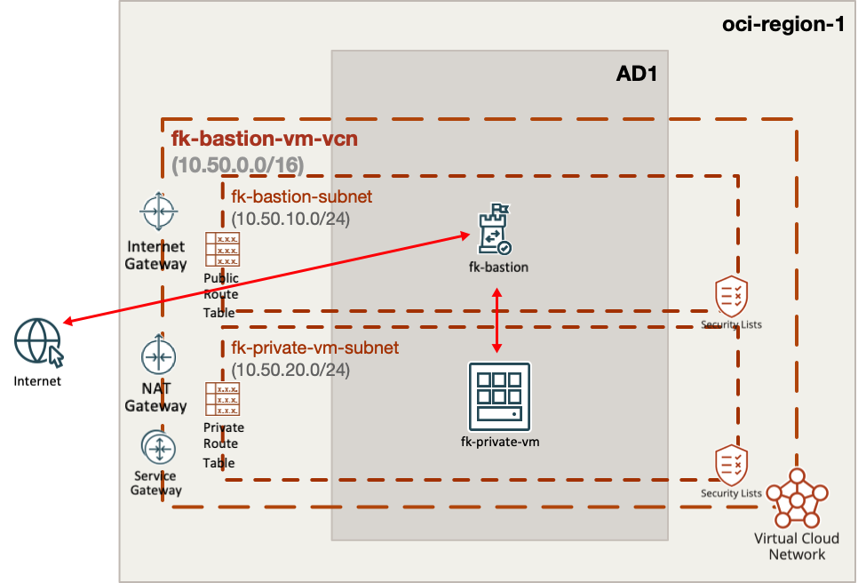
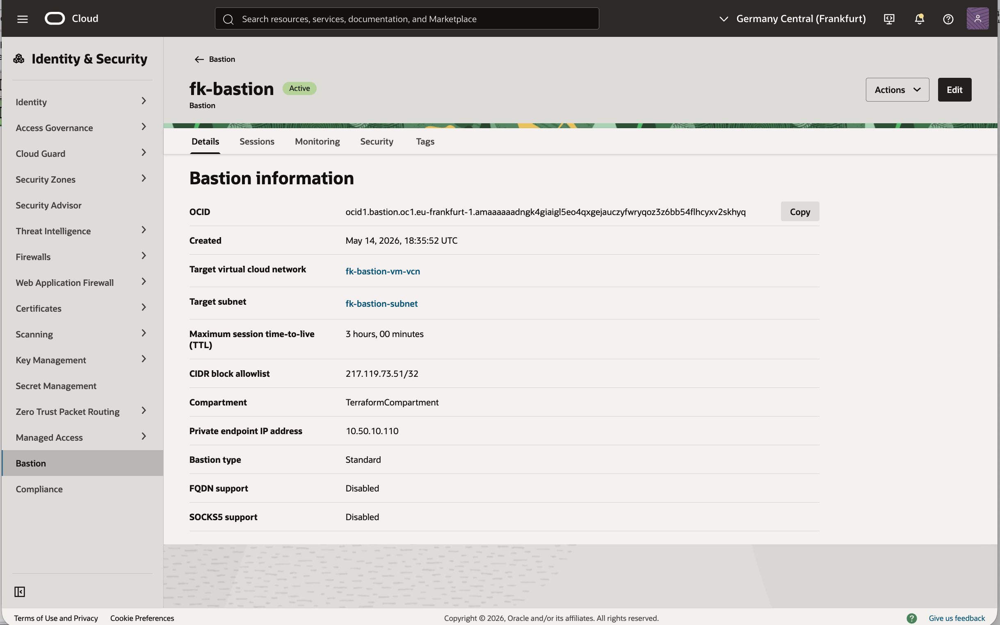
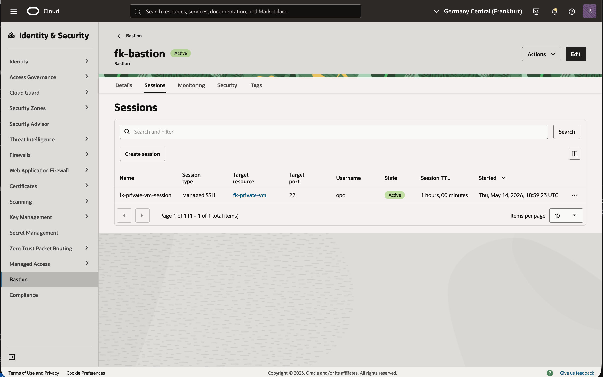
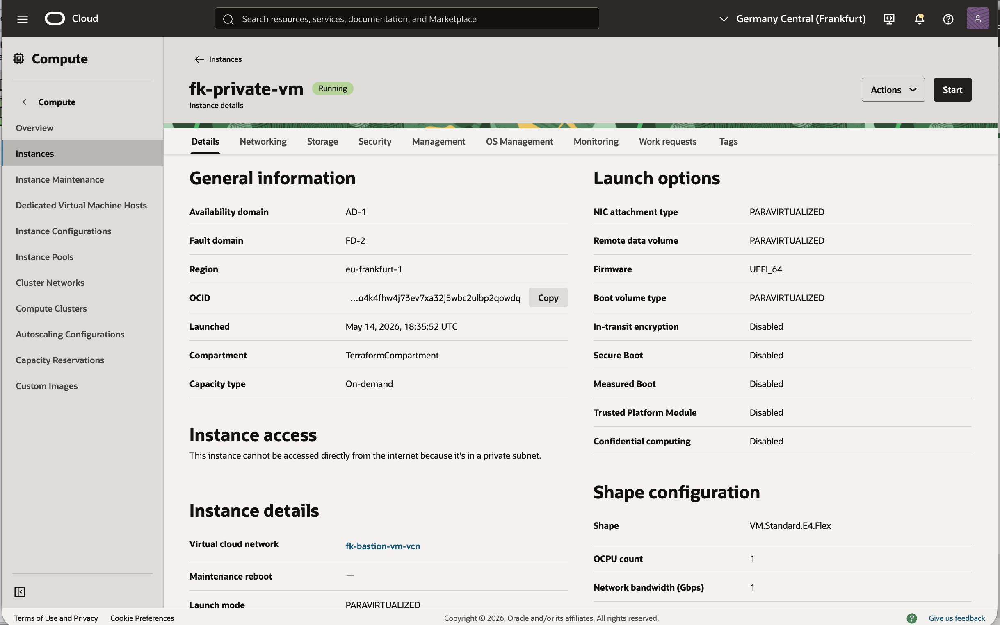
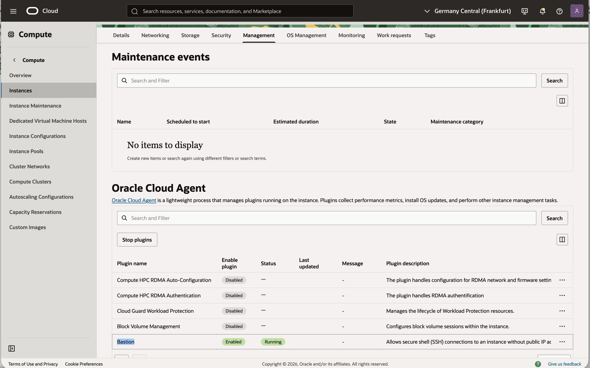

# Example 01: Private VM with OCI Bastion Service Access

In this example, we deploy a **private Oracle Cloud Infrastructure (OCI) compute instance** and provide operator access **exclusively through OCI Bastion Service** using a **managed SSH session**.

This example is intentionally focused on the **private-instance access path**:
- the instance has **no public IP**
- outbound egress is handled by **NAT Gateway**
- inbound SSH is allowed only from the **dedicated bastion subnet**
- the SSH key pair is generated automatically with the **TLS provider**
- the Compute module enables the **OCI Bastion plugin** required for `MANAGED_SSH`

---

## 🧭 Architecture Overview



This deployment creates:
- a dedicated **VCN** and two subnets using `terraform-oci-fk-vcn`
- one **private OCI compute instance** using `terraform-oci-fk-compute`
- one **OCI Bastion** using `terraform-oci-fk-bastion-service`
- one **managed SSH Bastion session** targeting the private VM

Key subnets:
- `fk-bastion-subnet` for the OCI Bastion private endpoint
- `fk-private-vm-subnet` for the workload

This is the most direct way to understand how the Bastion module behaves
when used for secure access to a single private VM.

---

## 🚀 Deployment Steps

Initialize and apply the Terraform/OpenTofu configuration:

```bash
cp terraform.tfvars.example terraform.tfvars
tofu init
tofu plan
tofu apply
```

If you prefer Terraform:

```bash
terraform init
terraform plan
terraform apply
```

After a successful deployment, Terraform/OpenTofu will output:
- the private VM instance ID
- the private IP address
- the Bastion ID
- the Bastion session ID
- the generated SSH command
- the generated private SSH key as a sensitive output

The example also includes a configurable wait after instance creation so OCI has
time to activate the Bastion plugin before the managed SSH session is requested.
The default is `600s`, because plugin activation is often slower than regular
instance provisioning.

---

## 🔐 Access Flow

After deployment, export the generated private key:

```bash
tofu output -raw ssh_private_key_pem > id_rsa
chmod 600 id_rsa
```

Then retrieve the generated Bastion command:

```bash
tofu output -raw session_ssh_command
```

OCI usually returns a ready-to-run SSH command. It should be structurally similar to:

```bash
ssh -i ./id_rsa \
  -o ProxyCommand="ssh -W %h:%p -i ./id_rsa -p 22 ocid1.bastionsession...@host.bastion.<region>.oci.oraclecloud.com" \
  opc@10.50.20.x
```

Expected result:
- successful SSH login to the private instance
- no public IP exposed on the VM
- access bounded by the Bastion session TTL

---

## ⚠️ Important Session Lifecycle Note

OCI Bastion sessions are temporary. Once the configured TTL expires, the session becomes inactive and may no longer be removable through `terraform destroy`.

For this reason:
- test the example soon after `apply`
- run `tofu destroy` before the Bastion session expires
- if the session is already inactive, you may need to remove it manually in OCI before retrying destroy

---

## ✅ Summary

This example demonstrates:
- how to deploy a **private OCI compute instance**
- how to use `terraform-oci-fk-bastion-service` for **managed SSH access**
- how to compose the Bastion module with `terraform-oci-fk-vcn` and `terraform-oci-fk-compute`
- how to generate an SSH key pair automatically for demo and testing purposes

---

## 🖼️ OCI Console And Runtime Verification

### Bastion Details



This view confirms that the Bastion resource is active and attached to the expected VCN and target subnet.
It also shows the private endpoint IP address created inside `fk-bastion-subnet`.

### Bastion Session



This view confirms that the managed SSH session was created successfully for target `fk-private-vm`.
The session is active, uses port `22`, and connects as user `opc`.

### Private VM Details



This view confirms that the private compute instance is running in the expected VCN and is not directly reachable from the internet.
That matches the intended design of this example, where access is provided only through OCI Bastion Service.

### Bastion Plugin Status



This view confirms that the Oracle Cloud Agent Bastion plugin is both enabled and in the `Running` state on the target VM.
That plugin state is required for OCI to create and use a `MANAGED_SSH` Bastion session successfully.

### SSH Validation

An end-to-end SSH test was completed through the generated OCI Bastion session.
Running the `session_ssh_command` and then executing `hostname` on the target returned `fk-private-vm`, confirming successful managed SSH access to the private instance.

---

## 🧹 Cleanup

To remove all resources created by this example:

```bash
tofu destroy
```

Or with Terraform:

```bash
terraform destroy
```

---

## 🌐 Learn More

Visit [FoggyKitchen.com](https://foggykitchen.com/) for OCI, multicloud, and Terraform/OpenTofu learning resources.

---

## 🪪 License

Licensed under the **Universal Permissive License (UPL), Version 1.0**.
See [LICENSE](../../LICENSE) for more details.

---

© 2026 [FoggyKitchen.com](https://foggykitchen.com) - Cloud. Code. Clarity.
